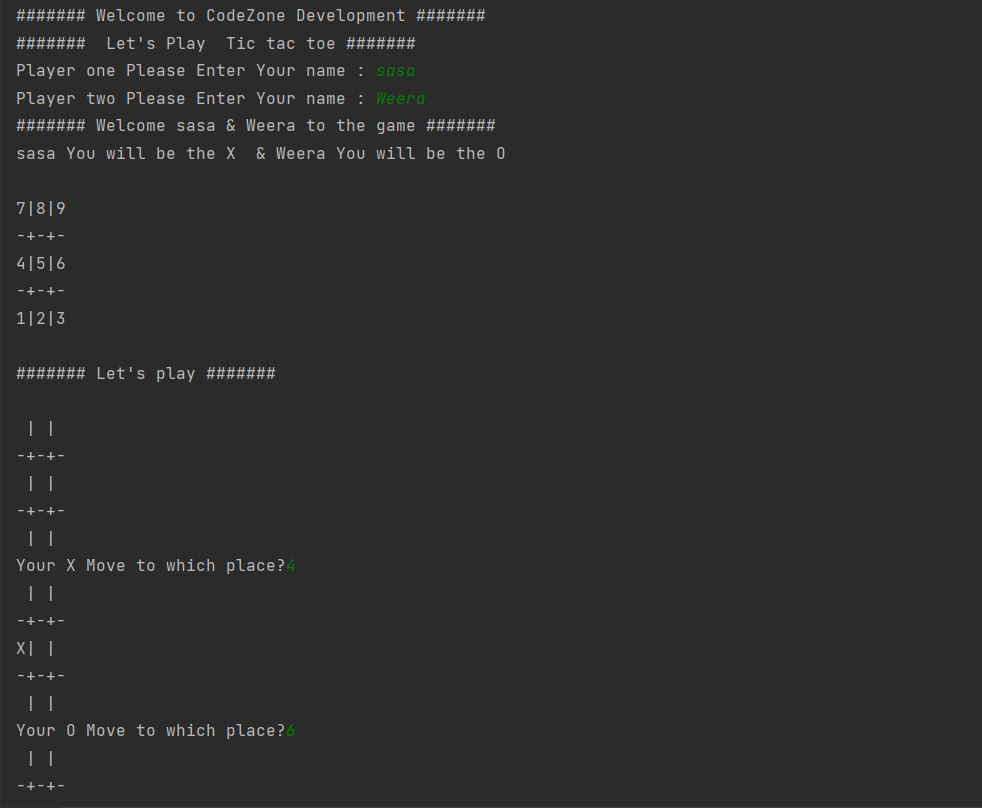
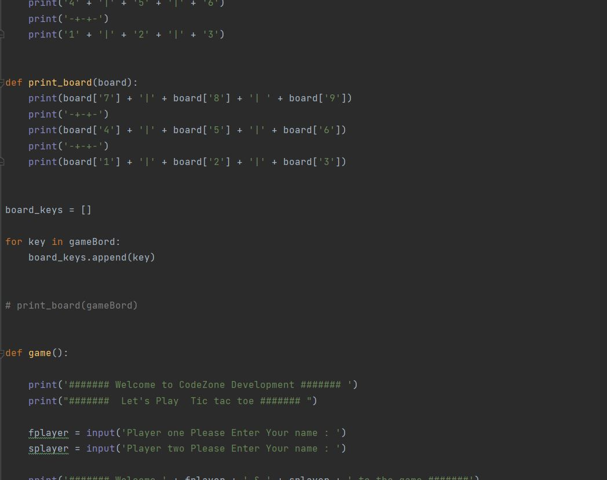

# TICTACTOE
Tic-tac-toe (American English), noughts and crosses (Commonwealth English and British English), or Xs and Os/“X’y O’sies” (Ireland), is a paper-and-pencil game for two players, X and O, who take turns marking the spaces in a 3×3 grid. The player who succeeds in placing three of their marks in a diagonal, horizontal, or vertical row is the winner. It is a solved game with a forced draw assuming best play from both players.

# INFO

Classic Tic-tac-toe game develop in python language. Develop with  simple python functions & basic methods. 
UI Design in command line interface (CLI)

# IMAGES
- UI  
   
- Development  

# LICENSE
MIT License: 
- Feel free to use the code as you please
